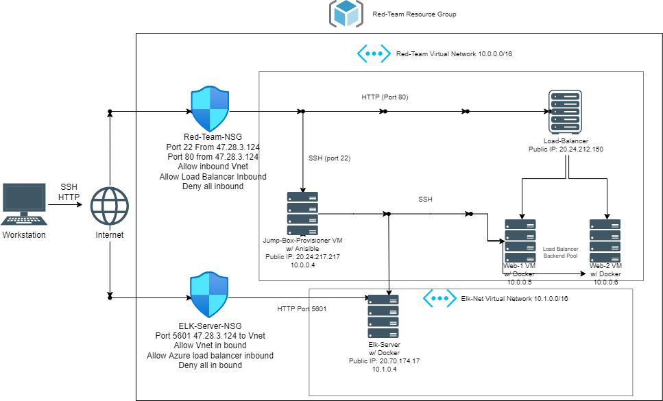
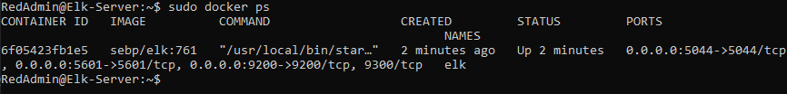

## Automated ELK Stack Deployment

The files in this repository were used to configure the network depicted below.

These files have been tested and used to generate a live ELK deployment on Azure. They can be used to either recreate the entire deployment pictured above. Alternatively, select portions of the playbook file may be used to install only certain pieces of it, such as Filebeat.

  
  
  

This document contains the following details:
- Description of the Topology
- Access Policies
- ELK Configuration
  - Beats in Use
  - Machines Being Monitored
- How to Use the Ansible Build

### Description of the Topology

The main purpose of this network is to expose a load-balanced and monitored instance of DVWA, the D*mn Vulnerable Web Application.

Load balancing makes sure that the application will be highly available, in addition to restricting inbound access to the network.
The load balancer makes sure that incoming traffic will be shared by both vulnerable web servers. Access controls will ensure that only authorized users will be able to connect in the first place.

Integrating an ELK server allows users to easily monitor the vulnerable VMs for changes to the file systems of the VM's on the network and system.

-Filebeat monitors log files, collects log events, then forwards them to Elasticsearch or Logstash.
- Metricbeat records metrics from the system and services running on the server. 

The configuration details of each machine may be found below.

| Name     | Function | IP Address | Operating System |
|----------|----------|------------|------------------|
| Jump Box | Gateway  | 10.0.0.1   | Linux            |
| WEB 1    |Web Server| 10.0.0.5   | Linux            |
| WEB 2    |Web Server| 10.0.0.6   | Linux            |
| ELK      |Monitoring| 10.1.0.4   | Linux            |

Zone #1 - Web 1 and Web 2
Zone #2 - ELK

### Access Policies

The machines on the internal network are not exposed to the public Internet. 

Only the jump box machine can accept connections from the Internet. Access to this machine is only allowed from the following IP addresses: 47.28.3.124

Machines within the network can only be accessed by each other.
The Web Server 1 and Web Server 2 send traffic to the ELK server. 
Web 1: 20.24.212.150
Web 2: 20.24.212.150

A summary of the access policies in place can be found in the table below.

| Name     | Publicly Accessible | Allowed IP Addresses |
|----------|---------------------|----------------------|
| Jump Box | Yes                 |    47.28.3.124       |
| ELK      | No - Port 5601      |    10.0.0.0/16      |
| WEB 1    | No                  |    10.0.0.0/16      |
| WEB 2    | No                  |    10.0.0.0/16     |

### Elk Configuration

Ansible was used to automate configuration of the ELK machine. No configuration was performed manually, which is advantageous because less chance of human error, automating saves time, makes it easy to deploy in other environments. 

The playbook implements the following tasks:
- Enables and configures docker module
- Downloads and installs Filebeat and Metricbeat
- Starts services for Filebeat and Metricbeat

The following screenshot displays the result of running `docker ps` after successfully configuring the ELK instance.

### Target Machines & Beats
This ELK server is configured to monitor the following machines:
WEB 1 and WEB 2 VM's, at 10.0.0.5 and 10.0.0.6

We have installed the following Beats on these machines: Filebeat and Metricbeat

These Beats allow us to collect the following information from each machine:

Filebeat: watches for log files/locations and collect log events. 

Metricbeat: records metrics and statistical data from the operating system and from services running on the server 

### Using the Playbook
In order to use the playbook, you will need to have an Ansible control node already configured. We use the Jump-Box-Provisioner for this. Assuming you have such a control node provisioned: 

SSH into the control node and follow the steps below:
- Copy the playbook file to ansible control node
- Update the hosts file to include groups and IP's
- Copy the files to the /etc/ansible/ directory
- Run the playbook, and navigate to Kibana to check that the installation worked as expected.

Go to http://20.211.104.97:5601/app/kibana#/home to confirm that the installation has worked. 

Command to download the playbook:
curl -L -O https://artifacts.elastic.co/downloads/beats/filebeat/filebeat-7.6.1-darwin-x86_64.tar.gz

tar xzvf filebeat-7.6.1-darwin-x86_64.tar.gz

cd filebeat-7.6.1-darwin-x86_64/